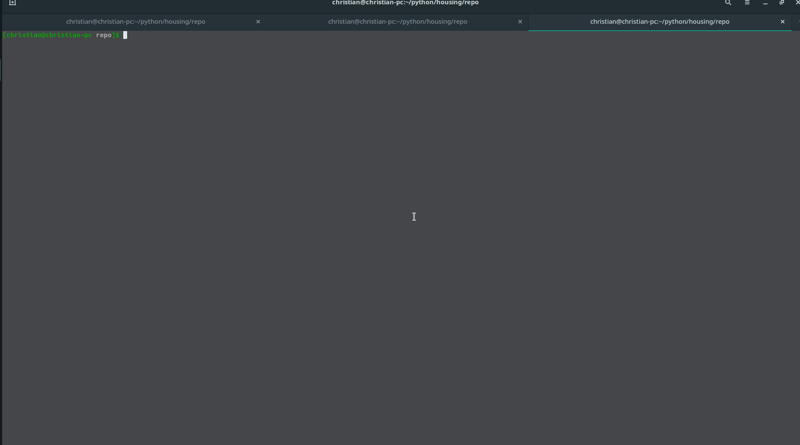

## Repo for scraping house prices

## How to run

The runner scrapes by default prices for Copenhagen (Zipcodes 1000-2000) and launches a flask app with these prices

```bash
python -m virtualenv
pip install -r requirements.txt
chmod u+x run.sh
./run.sh
```



## To change zip codes

Change the `zip_range` in the functions

```python
@click.command('scrape')
@with_appcontext
def scrape_command():
    """Clear the existing data and create new tables."""
    click.echo('Starting scrape.')
    scrape\
        .get_current_sales(loop_range=range(1,25),zip_range=[1000,2001])\
        .to_csv(filename, index=False)
    click.echo('Done!')
```


```python
@click.command('scrape_hist')
@with_appcontext
def scrape_hist_command():
    """Clear the existing data and create new tables."""
    click.echo('Starting scrape.')
    houses = scrape\
        .get_historic_sales(loop_range=range(1,500),zip_range=[1000,2001])\
        .drop_duplicates()
```